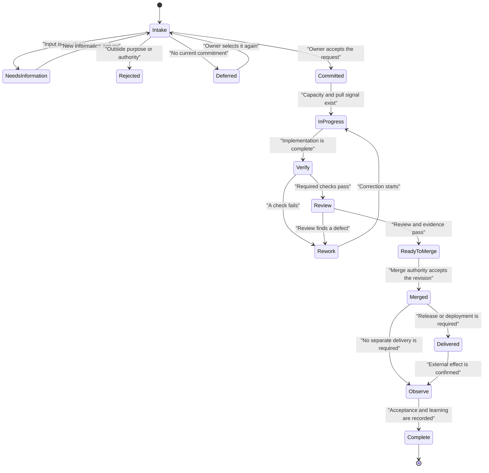

# Personal SDLC Factory Workflow

Status: First draft

## Goal

This workflow controls how people, agents, and services contribute code to one Git repository.

It applies mainly to Elixir projects. It covers public libraries such as `jido_action` and `req_llm`. It also covers private Phoenix applications such as `wayfinder`.

The first model is simple: **one Git repository is one factory unit**.

## Operating promise

The factory unit accepts a clear software change request. It returns one of these results:

- An accepted change on the protected branch.
- A release or deployment when the request includes delivery.
- A clear rejection, deferral, or request for more information.

The unit keeps work, decisions, evidence, and abnormal conditions visible. It stops when authority, state, evidence, or recovery is not clear.

## Factory boundary

The unit controls:

- GitHub Issues and admitted work.
- Beadwork tasks when agents need durable task detail.
- Branches and worktrees.
- Source code, tests, and documentation.
- Pull requests, review, and merge rules.
- CI evidence.
- Release or deployment preparation.

The unit depends on GitHub, package sources, Hex, deployment services, and other repositories. These systems are outside the unit boundary.

## Toyota Production System map

| TPS idea | Software factory meaning |
|---|---|
| Customer value | An accepted code change and, when required, a useful release or deployment. |
| Pull | An actor starts the next item only when a clear signal and capacity exist. |
| Kanban | The issue, task, pull request, or status that permits the next transition. |
| Work in process (WIP) | Admitted work that has left the commitment backlog and has started. |
| Standard work | The current approved flow, checks, evidence, and recovery rules. |
| Quality at the source | The actor verifies its output before it gives the work to the next actor. |
| Jidoka | A failed gate stops the affected work. The process does not hide the defect. |
| Andon | A visible stop record with evidence, containment, owner, and recovery status. |
| Gemba | The issue, code, diff, test output, CI result, logs, and running system where the work is visible. |
| Kaizen | A measured change to the workflow or standard work. |

## Actors

| Actor | Main responsibility | Normal authority |
|---|---|---|
| Owner | Sets purpose, priority, acceptance conditions, and risk limits. | Accepts commitments and important exceptions. Approves merge, release, or deployment when policy requires it. |
| Planner | Turns an accepted request into a bounded plan. This actor can be a person or an agent. | Proposes scope, tasks, checks, and risks. Does not change code. |
| Implementer | Changes code in an isolated branch or worktree. This actor can be a person or one or more agents. | Changes only the admitted scope. Runs local checks. |
| Simplifier | Removes unnecessary complexity after the implementation works. | Can propose or make behavior-preserving changes in the admitted scope. |
| Reviewer | Checks correctness, design, security, maintainability, and scope. | Requests rework or recommends acceptance. Does not approve its own high-risk work. |
| CI service | Runs repeatable checks on the candidate revision. | Reports evidence. It does not decide product value. |
| Merge authority | Applies an accepted change to the protected branch. | Merges only when all required gates pass. |
| Release operator | Publishes a library or deploys an application. This actor can be a person or a service. | Acts only under the release policy and with a recovery plan. |
| Receiver | Uses the library or application and supplies result feedback. | Accepts the delivered result or reports a problem. |

One person or agent can hold more than one role for low-risk work. High-risk work should separate implementation, review, and effect approval.

## Work records

| Record | Purpose |
|---|---|
| GitHub Issue | Holds the request, commitment, acceptance conditions, priority, and final result. |
| Beadwork item | Holds durable agent tasks, dependencies, progress, and decisions across sessions. |
| Branch or worktree | Isolates active code WIP. |
| Pull request | Holds the candidate change, review discussion, and merge gates. |
| CI run | Supplies repeatable verification evidence for one candidate revision. |
| Release or deployment record | Records the external effect and its result. |
| Issue or solution note | Preserves useful learning for later work. |

GitHub Issues are the main work record. Beadwork can add internal task detail. It does not replace the accepted scope or acceptance conditions in the issue.

## State machine

An Andon condition can stop work in any active state. Examples are a failed required check, an unknown repository state, a secret leak, an unsafe migration, a changed target branch, missing authority, or uncertain release or deployment effect. The actor preserves evidence, contains the affected work, and gets help when local recovery is not permitted.

## Standard flow

### 1. Intake and admission

The owner or planner records the requested result, reason, repository, acceptance conditions, constraints, and risk. The owner accepts, rejects, defers, redirects, or asks for information.

Acceptance creates a commitment. It does not start code work.

### 2. Pull work

The implementer pulls one ready commitment only when capacity exists. The work enters fulfillment WIP at this point.

Start with these limits:

- One primary implementation item per implementer.
- One expedite item for the factory unit at a time.
- No hidden agent work outside an issue or Beadwork item.

### 3. Brainstorm and plan

Use the Compound Engineering loop when the work is not trivial:

`brainstorm → plan → work → simplify → code-review → compound`

The plan defines the result, boundaries, units of work, acceptance evidence, and risks. It does not pre-write the implementation.

### 4. Implement

The implementer uses a branch or worktree. Each change stays inside the admitted scope. The implementer records important decisions and runs quick checks during the work.

### 5. Verify at the source

The candidate revision must pass the checks that apply to the project. The normal Elixir checks are:

- `mix format --check-formatted`
- Compilation with warnings treated as errors.
- Relevant focused tests.
- The full test suite when its cost and scope permit it.
- Credo, Dialyzer, security checks, and documentation checks when the project config requires them.

The pull request links the exact candidate revision to its evidence.

### 6. Simplify and review

The simplifier removes avoidable complexity without changing required behavior. The reviewer checks the diff, tests, acceptance conditions, public contracts, operational risk, and recovery path.

A failed check or valid review finding returns the item to visible rework. Rework has a limit. Repeated failure causes an Andon stop and a new decision.

### 7. Merge

The merge authority pulls the change only when the target branch is current, required evidence is fresh, required reviews pass, and no stop condition is active.

The protected branch is the accepted repository product.

### 8. Deliver and observe

A merge does not always complete the customer result.

- For a library, delivery can include a version, changelog, Hex package, and downstream compatibility check.
- For a private Phoenix application, delivery can include a deployment, migration, health check, smoke test, telemetry check, and rollback readiness.

The release operator records whether the effect is confirmed, uncertain, contained, or reversed. The unit does not retry an uncertain external effect until it reconciles the actual state.

### 9. Compound the learning

The owner or agent closes the issue with the result and evidence. A useful learning becomes a short solution note, test, rule, tool, or change to standard work.

The change is a countermeasure first. It becomes an improvement only after evidence shows a better result without unacceptable harm.

## Project-specific quality gates

| Area | Elixir library | Private Phoenix application |
|---|---|---|
| Main customer | Library user and dependent project. | Application user and operator. |
| Main contract | Public modules, functions, types, behavior, documentation, and semantic version. | User behavior, HTTP or LiveView interfaces, data, jobs, operations, and security. |
| Extra verification | Documentation build, public API compatibility, dependency range, package contents, and a downstream use case. | Database migration safety, asset build, runtime config, background jobs, authorization, telemetry, and deployment smoke test. |
| Main effect | Tag, GitHub release, or Hex publication. | Deployment and any database or service changes. |
| Recovery | Deprecation, patch release, yanked package when permitted, or documented rollback. | Application rollback, migration recovery, feature disablement, or traffic containment. |

## Pull signals and quality gates

| Transition | Pull signal | Required evidence |
|---|---|---|
| Committed → In progress | A ready item, available capacity, clear authority, and no blocking dependency. | Accepted issue and bounded plan when needed. |
| Verify → Review | The implementer reports a complete candidate revision. | Diff and required local or CI checks. |
| Review → Ready to merge | A reviewer accepts the candidate and all gates pass. | Review record, CI results, and acceptance-condition check. |
| Ready to merge → Merged | The protected branch can accept work. | Fresh target state, accepted revision, and merge authority. |
| Merged → Delivered | Release or deployment policy permits the effect. | Effect plan, authority, current target state, and recovery method. |
| Observe → Complete | The receiver result is known and material learning is recorded. | Result evidence and issue closure note. |

## First measures

Start with a small set of measures:

- Age of the oldest committed item.
- Number of active implementation items.
- Time from work start to merge.
- Time spent blocked.
- CI failure and rework count.
- Review wait time.
- Release or deployment failure count.
- Number of Andon stops and their causes.

Use the measures to find delay and defects. Do not use them to reward activity or code volume.

## Open questions for the next draft

- What exact WIP limits should apply to one person with several agents?
- Which changes can merge without direct owner approval?
- Which checks are standard for every Elixir repository?
- When is a downstream integration test required for a library?
- What consequence level requires separate implementer and reviewer actors?
- Where should durable decisions and compound learnings live?
- How should work move across several related repositories?
