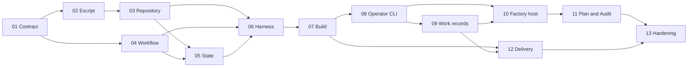

# Hancho Build Plan

Hancho is an Elixir escript that coordinates CLI coding harnesses in one Git repository. It uses repository-local configuration and durable state in `./.hancho/`.

This plan uses small releases. Each release must produce a result that a user can test.

## Fixed decisions

- The product, executable, and Elixir namespace are `hancho`, `hancho`, and `Hancho`.
- The Mix project lives at the repository root.
- The first package is an escript. Hancho still uses an OTP supervision tree.
- One control checkout and its `./.hancho/` folder form one local factory unit.
- SQLite stores operational state. Files store raw logs and large artifacts.
- A workflow requests capabilities. Repository configuration routes each station to a CLI harness.
- Built-in workflows are versioned Elixir modules in the first release.
- GitHub Issues own commitments. Beadwork owns internal execution work.
- A harness can edit a worktree. It cannot commit, push, merge, release, or close a work item.

## Release sequence

| Release | Outcome | Epics |
|---|---|---|
| 0.1: Walking skeleton | A portable escript runs one fake, durable workflow and shows its result. | 01-05 and 06.1-06.5 |
| 0.2: Build candidate | A real harness can make and verify a bounded Elixir change in an isolated worktree. | 06.6-09 |
| 0.3: Local factory | Hancho can stay active in the foreground or in tmux and control WIP. | 10 |
| 0.4: More workflows | Plan.V1 and Audit.V1 use the same engine and harness protocol. | 11 |
| 1.0: Trusted tool | Acceptance effects, installation, security, tests, measures, and migration from the Bash driver are complete. | 12-13 |

## Epic order

1. [Product contract and technical spikes](01-product-contract-and-spikes.md)
2. [Elixir escript foundation](02-elixir-escript-foundation.md)
3. [Repository discovery, initialization, and configuration](03-repository-init-and-configuration.md)
4. [Versioned workflow engine](04-versioned-workflow-engine.md)
5. [Durable state, journal, and artifacts](05-durable-state-and-artifacts.md)
6. [Harness protocol, adapters, and routing](06-harness-protocol-and-routing.md)
7. [Git safety and Build.V1](07-git-safety-and-build-v1.md)
8. [Operator CLI, decisions, and recovery](08-operator-cli-and-recovery.md)
9. [GitHub and Beadwork boundary](09-github-and-beadwork-boundary.md)
10. [Continuous factory and tmux host](10-continuous-factory-and-tmux.md)
11. [Plan.V1, Audit.V1, and instruction packs](11-plan-audit-and-instruction-packs.md)
12. [Acceptance, delivery, and feedback](12-acceptance-delivery-and-feedback.md)
13. [Hardening, packaging, and Kaizen](13-hardening-packaging-and-kaizen.md)

The [inbox review](00-inbox-review.md) shows how each source idea enters this plan.

## Dependency map

## Common completion rules

Every epic must meet these rules:

- Tests cover the normal path, a rejected input, and a failed external effect.
- Commands return stable exit codes and support non-interactive use.
- Durable facts have stable IDs and UTC times.
- Error text tells the user what is safe and what command to use next.
- No test needs a paid model or a network connection.
- The user documentation changes with the behavior.

## Explicit non-goals for the first release

- A Phoenix application.
- A graphical or full-screen terminal interface.
- Direct provider SDK or model API integration.
- Automatic two-way sync between GitHub and Beadwork.
- Native `launchd` or `systemd` services.
- DuckDB as the operational store.
- Cross-repository workflow coordination.
